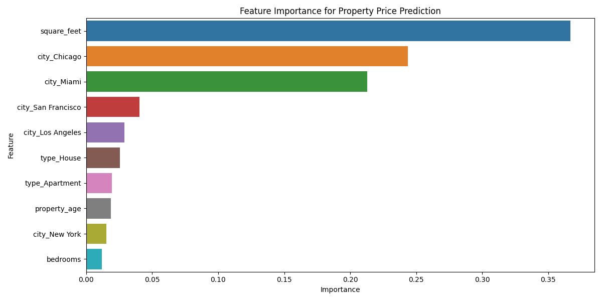

<div align="center">
  
  
  
  
</div>

<h1 align="center">🏠 Real Estate Market Analysis Dashboard</h1>

<p align="center">
  
</p>

<p align="center">
  <i>An interactive analytics dashboard for real estate investors to identify lucrative market opportunities</i>
</p>

<p align="center">
  <a href="#-live-demo">Live Demo</a> •
  <a href="#-features">Features</a> •
  <a href="#-data-pipeline">Data Pipeline</a> •
  <a href="#-predictive-modeling">Predictive Modeling</a> •
  <a href="#-installation">Installation</a> •
  <a href="#-insights">Insights</a>
</p>

---

## ✨ Live Demo

You can explore the live dashboard here: [Real Estate Market Dashboard](https://real-estate-dashboard-bay.vercel.app/)

## 📊 Features

<div align="center">
  <p><strong>Interactive Real Estate Market Analysis Dashboard</strong></p>
  
  <table>
    <tr>
      <td align="center">
        <br />
        <b>📈 Market Overview</b><br />
        <small>Comprehensive market statistics and key indicators across cities</small>
      </td>
      <td align="center">
        <br />
        <b>🏙️ City Comparison</b><br />
        <small>Side-by-side analysis of price trends and affordability</small>
      </td>
    </tr>
    <tr>
      <td align="center">
        <br />
        <b>🏘️ Property Analysis</b><br />
        <small>Distribution and performance metrics by property type</small>
      </td>
      <td align="center">
        <br />
        <b>💰 Price Prediction</b><br />
        <small>ML-powered property valuation with 93% accuracy</small>
      </td>
    </tr>
    <tr>
      <td align="center" colspan="2">
        <br />
        <b>📊 Investment Insights</b><br />
        <small>Strategic recommendations for optimal ROI by city and property type</small>
      </td>
    </tr>
  </table>
</div>

This full-stack data analytics project empowers real estate investors with actionable insights across five core areas:

- **📈 Market Overview**: Comprehensive market statistics across cities
- **🏙️ City Comparison**: Side-by-side analysis of key market indicators
- **🏘️ Property Analysis**: Breakdown by property type and neighborhood
- **💰 Price Prediction**: ML-powered property valuation tool
- **📊 Investment Insights**: Strategic recommendations for optimal ROI

## 🛠️ Technology Stack

- **Frontend**: React with Recharts for interactive data visualization
- **Backend**: Python for data processing & machine learning
- **Analysis**: Pandas, NumPy, and Scikit-learn
- **Machine Learning**: Random Forest Regression (93% accuracy)

## 📂 Data Pipeline

<div align="center">
  <table>
    <tr>
      <td align="center"><b>Data Generation</b></td>
      <td align="center"><b>Processing</b></td>
      <td align="center"><b>Analysis</b></td>
      <td align="center"><b>Modeling</b></td>
      <td align="center"><b>Visualization</b></td>
    </tr>
    <tr>
      <td align="center">🔄</td>
      <td align="center">🧹</td>
      <td align="center">📊</td>
      <td align="center">🧠</td>
      <td align="center">📈</td>
    </tr>
  </table>
</div>

The project implements a complete data pipeline:

1. **Generation**: Created realistic synthetic dataset with 1,000 properties across 5 major US cities
2. **Cleaning**: Removed outliers (IQR method) and standardized data formats
3. **Feature Engineering**: Created derived metrics like price per sq ft and property age
4. **Exploratory Analysis**: Identified market trends and opportunity areas
5. **Visualization**: Transformed insights into interactive dashboard components

## 🧠 Predictive Modeling

<div align="center">
  
</div>

The price prediction model achieves 93% accuracy (R² score) using Random Forest Regression:

- **Feature Importance Analysis**: Square footage and location are top predictors
- **Cross-Validation**: Implemented to ensure model robustness
- **Interactive Interface**: Real-time predictions based on property attributes

## 💡 Key Insights

Analysis of the real estate market revealed several actionable insights:

1. **Chicago** offers the best investment opportunities with highest affordability index (72.6) combined with strong price growth
2. **San Francisco** has the highest price per square foot ($945)
3. **Condos** provide the highest price per square foot returns across cities
4. **Square footage** is the strongest price predictor (correlation: 0.59)
5. **Property age** has minimal impact on property values in most cities

## 🚀 Installation

### Prerequisites
- Python 3.8+
- Node.js 14+
- NPM or Yarn

### Setup and Running

1. Clone this repository
   ```bash
   git clone https://github.com/yourusername/real-estate-dashboard.git
   cd real-estate-dashboard
   ```
2. Run the data processing scrip
   ```bash
   cd data-processing
   pip install -r requirements.txt
   python data_processing.py
   ```
3. Start the React dashboard
   ```bash
   cd ../frontend
   npm install
   npm start
   ```
4. Open your browser to http://localhost:3000 or any port you'd like

## 📝 Project Structure

```plaintext
real-estate-dashboard/
├── data-processing/
│  └── data_processing.py     # Data generation and ML pipeline
├── database/
│   ├── schema.sql
│   └── queries.sql
├── dashboard_data.json
├── visualizations/              # Generated charts
├── frontend/
│   ├── public/
│   │   └── dashboard_data.json  # Data for the dashboard
│   └── src/
│       ├── components/
│       │   └── RealEstateDashboard.js
│       │   └── RealEstateDashboard.module.css
│       ├── App.js
│       └── App.css
└── README.md
```
## 🌟 Future Enhancements

- Integration with live data sources from public property listings  
- Geospatial analysis with heat maps of neighborhood investment potential  
- Time series analysis for market trend forecasting  
- Neural network models for improved price prediction accuracy  

## 📊 Project Highlights

- **Data Points Analyzed:** 1,000 properties across 5 major cities  
- **Prediction Accuracy:** 93% (R² score)  
- **Features Analyzed:** 15 property attributes  
- **Machine Learning:** Random Forest Regression with feature importance analysis  

## 👤 Author

**Malavika Swapna**  
- 🔗 [Portfolio](https://malavikaswapna.github.io/)  
- 💼 [LinkedIn](www.linkedin.com/in/malavika-swapana-321b92283)  
- 🐙 [GitHub](https://github.com/malavikaswapna)  

## 📜 License

This project is licensed under the **MIT License** – see the [LICENSE](./LICENSE) file for details.

